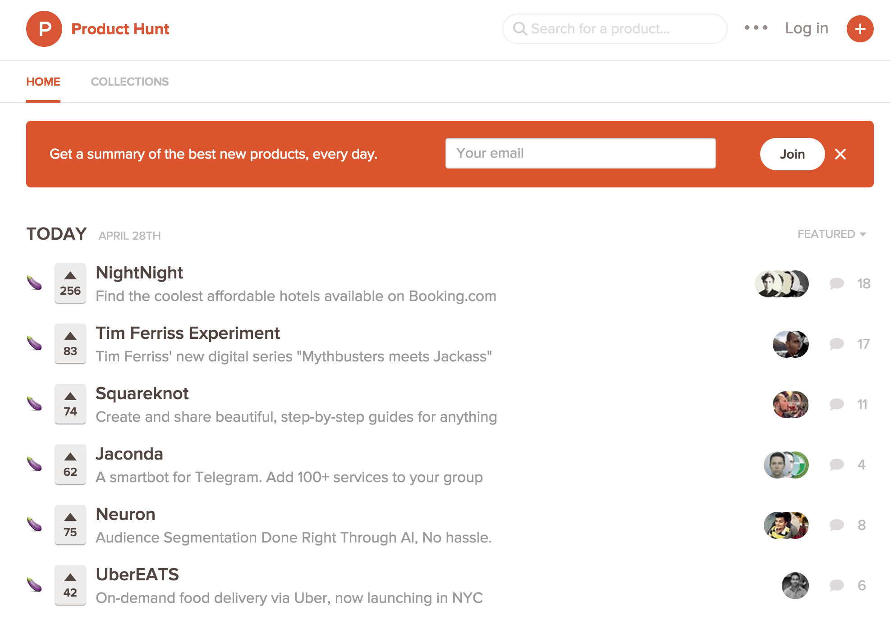

# SeenHunt

It's a Safari extension to help you keep track of which items on Product Hunt are new since your last visit. If it's new, it gets an aubergine emjoi.

## Contributing

Feel free to fork and add features and submit pull requests if you think they'd be useful to others.

## Limitations

- Keeps track in HTML5 localStorage, so if you switch computers your state will be lost
- Only applies aubergines to products in the initial page load
- Auto cleans localStorage to remove items that you saw more than about 3 days ago. This helps keep localStorage manageable.

## Aubergine

It's an eggplant.
